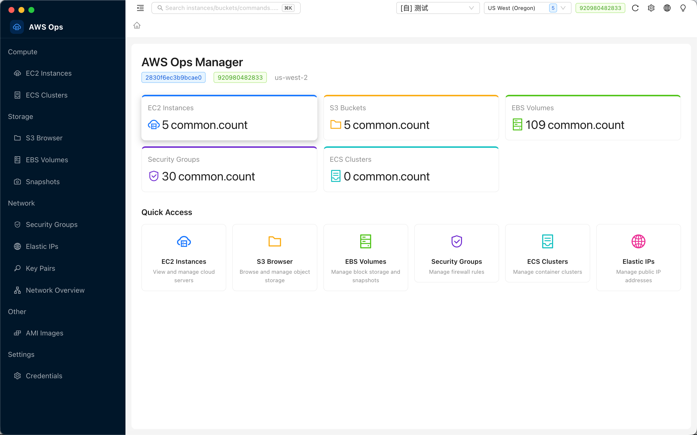

  

# AWS Ops Manager

Cross-platform AWS operations desktop client — manage EC2, S3, EBS, Security Groups, Elastic IPs, Key Pairs, AMI, Network, and more from a single desktop app.

**English** | [简体中文](#)

  

## Features

- **EC2** — instance list with type hints, start/stop/reboot, 8-tab detail view, CloudWatch charts, SSM terminal & Run Command
- **S3** — bucket browser, upload/download with progress, inline file editor, 7-tab bucket detail (policy, encryption, lifecycle, etc.)
- **EBS & Snapshots** — volume create/attach/detach, snapshot management
- **Security Groups** — inbound/outbound rules with 8 presets (SSH/HTTP/HTTPS/MySQL/...)
- **Network** — VPC, subnets, route tables, IGW, NAT gateways
- **Elastic IPs & Key Pairs** — allocate/associate/release, create/import (.pem download)
- **AMI** — list owned images, cross-region copy, deregister
- **Credentials** — ~/.aws profiles + AES-256-GCM encrypted custom keys
- **Bilingual UI** — English / 简体中文 toggle in header
- **Cmd+K** global resource search, dark/light theme, API cache

## Download

[Latest Release](https://github.com/S0x007/aws-ops-manager/releases)

| Platform | Format |
|----------|--------|
| macOS (Apple Silicon) | `.dmg` |
| macOS (Intel) | `.dmg` |
| Windows | `.exe` installer |
| Linux | `.AppImage` |

## License

[MIT](LICENSE)
