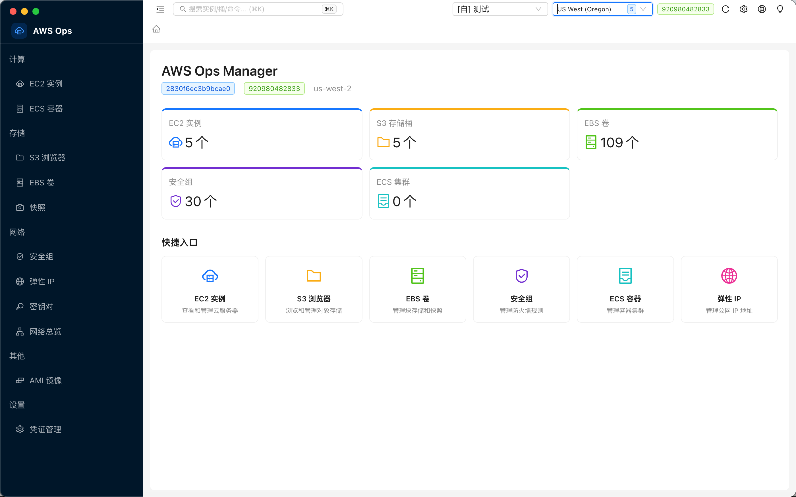

  

# AWS Ops Manager

跨平台 AWS 运维桌面客户端。通过 **AWS Access Key / Secret Key** 连接 AWS，在一个应用中管理 EC2、S3、EBS、安全组、弹性 IP、密钥对、AMI、网络等资源。

> **工作原理：** 本工具通过你的 Access Key / Secret Key 调用 AWS API 进行运维操作。不提供云端账号 — 你需要自带凭证。支持 `~/.aws/config` 配置文件 和 内置 AES-256-GCM 加密凭证存储两种方式。

[English](README.md) | **简体中文**

## 功能

- **EC2** — 实例列表（含规格说明）、启动/停止/重启、8 个详情 Tab、CloudWatch 监控、SSM 终端 & 命令下发
- **S3** — 存储桶浏览、上传/下载进度、在线文件编辑器、桶详情（策略/加密/生命周期等）
- **EBS & 快照** — 卷创建/挂载/卸载、快照管理
- **安全组** — 入站/出站规则，8 种预设（SSH/HTTP/HTTPS/MySQL/...）
- **网络** — VPC、子网、路由表、互联网网关、NAT 网关
- **弹性 IP & 密钥对** — 分配/关联/释放、创建/导入（可下载 .pem）
- **AMI** — 自有镜像列表、跨区域复制、注销
- **凭证管理** — `~/.aws/config` 配置 + AES-256-GCM 加密存储
- **中英双语** — 顶部一键切换
- **Cmd+K** 全局搜索、暗色/亮色主题、API 缓存

## 下载

[最新版本](https://github.com/S0x007/aws-ops-manager/releases)

| 平台 | 格式 |
|------|------|
| macOS (Apple Silicon) | `.dmg` |
| macOS (Intel) | `.dmg` |
| Windows | `.exe` 安装包 |
| Linux | `.AppImage` |

## 开源协议

[MIT](LICENSE)
